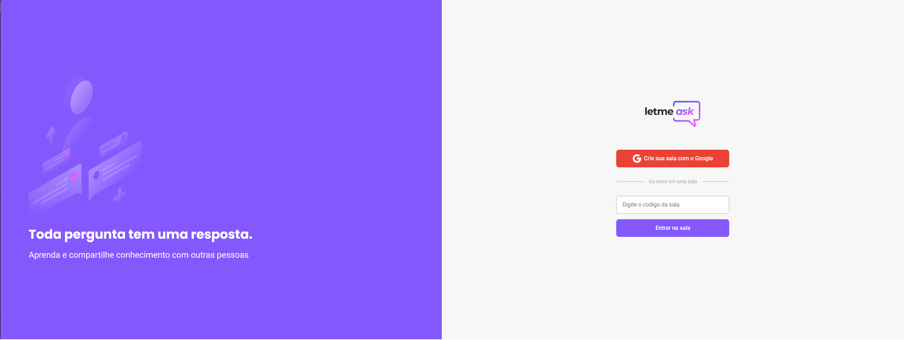
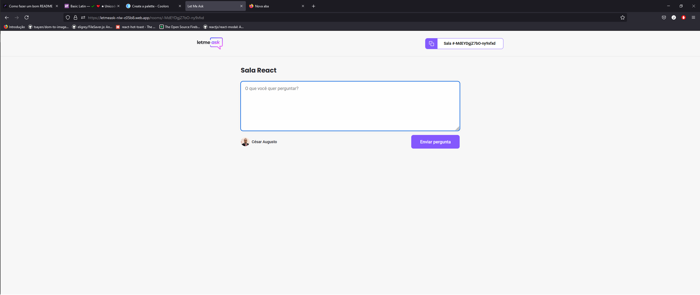

	

<h1 id="#sobre" align="center">Let me Ask</h1>

<h4 align="center">Projeto criado na semana NLW together sexta edição 🚀</h4>

Tabela de conteúdos
=================
<!--ts-->
* [Sobre](#Sobre)
* [Tabela de Conteudo](#tabela-de-conteudo)
* [Instalação](#instalacao)
* [Como usar](#como-usar)
* [Pre Requisitos](#pre-requisitos)
* [Local files](#local-files)
* [Remote files](#remote-files)
* [Tecnologias](#tecnologias)
<!--te-->

<h4 align="center">
	🚧 Let me ask 🚀 Em construção... 🚧
</h4>

- [x] Criação de salas para perguntas
- [x] Modo noturno
- [x] Responsivo

	
	
	
	

