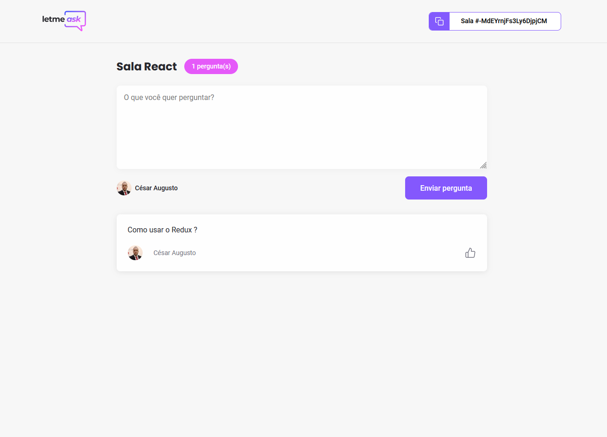

	

<h1 id="#sobre" align="center">Let me Ask</h1>

<h4 align="center">Projeto criado na semana NLW together sexta edição 🚀</h4>

<h4 align="center">🚧 Let me ask em construção... 🚧</h4>

Tabela de conteúdos
=================

	<a href="#sobre">Sobre</a> •
	<a href="#objetivo">Objetivo</a> •
	<a href="#tecnologias">Tecnologias</a> •
	<a href="#licença">Licença</a> •
	<a href="#autor">Autor</a>

Sobre
=================

	O letmeask é uma aplicação desenvolvida para pessoas que fazem live e que desejam coletar as perguntas da sua
	audiência. O aplicativo permite que a comunidade envie perguntas e as outras pessoas podem curtir e o apresentador tem
	acesso as maiores duvidas do seu publico.

Imagens
=================

	
	

Tecnologias
=================

Objetivo
=================

O objetivo principal de eu ter focado nesse nlw, foi observar de
	perto como é construido e estruturado um projeto real, padrões de projeto,
	composição das pastas e fluxo de desenvolvimento foram os aprendizados principais
	que eu busquei prestar mais atenção e esse evento me trouxe bastante conhecimento,
	que eu pretendo usar em todo projeto que eu for trabalhar.

Licença
=================

Este projeto pode ser usado por qualquer pessoa - Licença MIT

Autor
=================

Feito com ♥ por <a href="https://www.linkedin.com/in/c%C3%A9sar-augusto-1459ab1b2/">Cesar Augusto</a>

